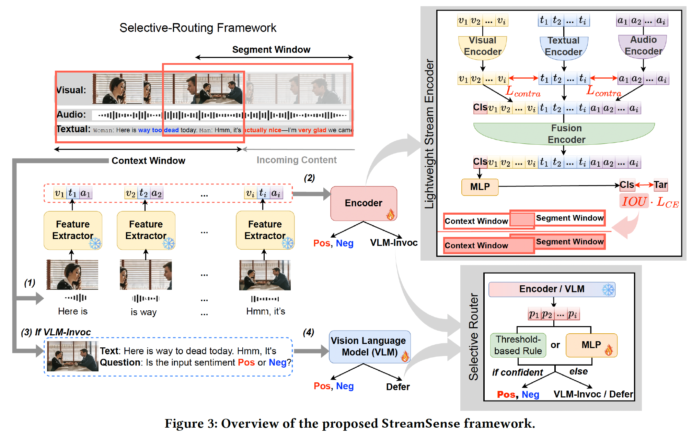
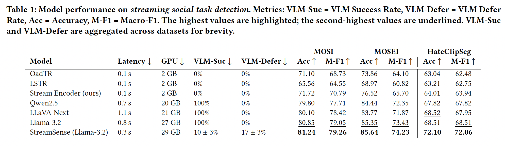

# StreamSense: Streaming Social Task Detection with Selective Vision–Language Model Routing

Official code repository for **StreamSense**.

## Overview

Live streaming platforms require real-time understanding of multimodal social signals under partial and asynchronous observations. **StreamSense** addresses this challenge with a low-latency streaming framework that combines a lightweight multimodal encoder with **selective routing** to a large Vision–Language Model (VLM). The system efficiently handles most timestamps with the lightweight encoder while escalating only ambiguous cases to the VLM, achieving a favorable trade-off between accuracy and computational cost.

## Architecture

Streaming detection demands frequent, fast decisions, whereas complex social reasoning benefits from large, compute-intensive models. StreamSense adopts a **two-stage pipeline**:

1. **Lightweight Streaming Encoder** for efficient per-timestamp predictions.
2. **Selective VLM Routing** for hard or ambiguous cases requiring deeper cross-modal reasoning.

This design enables near-VLM performance with substantially reduced latency and cost.



## Training Objectives

To address multimodal alignment and the mismatch between segment-level annotations and stream-level inference, we employ two complementary objectives.

### Cross-Modal Contrastive Alignment

We align visual and audio representations with textual semantics using a contrastive objective:

$$
\mathcal{L}^{\alpha}_{\text{CM}}
= \frac{\alpha}{2}\big(
\mathcal{L}_{\text{contra}}(t, v) +
\mathcal{L}_{\text{contra}}(t, a)
\big),
$$

where $\mathcal{L}_{\text{contra}}$ denotes the text–visual and text–audio contrastive losses.


### IoU-Weighted Cross-Entropy

To provide temporally adaptive supervision, we weight each instance by its temporal overlap with the ground-truth segment:

$$
\mathcal{L}^{\beta}_{\text{IoU}\times\text{CE}}
= -\frac{1}{B}\sum_{i=1}^{B}
\mathrm{IoU}(W^i, S^i)^{\beta}
\, y_i \log p(y_i \mid x^i),
$$

where

$$
\mathrm{IoU}(W^i, S^i)
= \frac{|W^i \cap S^i|}{|W^i \cup S^i|}.
$$

These objectives jointly encourage robust cross-modal representations and temporally aware learning.

## Training and Inference

### Train Lightweight Streaming Encoder
```bash
python ./model/Encoder/main.py \
  --alpha 0.25 \
  --beta 1.0 \
  --dataset_name MOSI \
  --modality vta \
  --output_dir ./checkpoint/MOSI \
  --root .
````

### Train Vision–Language Model (VLM)

```bash
python ./model/VLM/train.py \
  --dataset_name MOSI \
  --modality vt \
  --epochs 10
```

### VLM Inference

```bash
python ./model/VLM/inference.py \
  --dataset_name MOSI \
  --modality vt \
  --data_type test
```

## Selective Routing Strategy

To balance efficiency and accuracy, we employ a **threshold-based routing rule**. The VLM is invoked when either (i) a label change is detected or (ii) the encoder confidence falls below a dynamic threshold:

$$
\theta^{\text{Enc}}(d)
= 0.5 + \frac{d}{\text{MaxEnc}+1}\cdot 0.5,
\quad 1 \le d \le \text{MaxEnc}+1,
$$

where $d = i - t_{\text{vlm}}$ denotes the distance from the last VLM invocation. As $d$ increases, encoder predictions are considered less reliable; when $d=\text{MaxEnc}+1$, a VLM call is forced.

### Routing Inference

```bash
python ./model/Router/vlm_invoke_and_skip.py \
  --encoder_csv path_to_encoder_prediction \
  --vlm_csv path_to_vlm_prediction \
  --MaxDefer 6 \
  --MaxEnc 18
```

## Results

Across benchmarks, StreamSense achieves performance close to full VLM-based detection while significantly reducing inference latency and computational cost, demonstrating its suitability for large-scale social video streaming scenarios.



## Reference
```
@inproceedings{wang2026streamsense,
  title     = {StreamSense: Streaming Social Task Detection with Selective Vision-Language Model Routing},
  author    = {Wang, H. and Deyi Ji and Lanyun Zhu and Jiebo Luo and Roy Ka-Wei Lee},
  booktitle = {Proceedings of the ACM on Web Conference 2026 (WWW)},
  year      = {2026}
}
```


